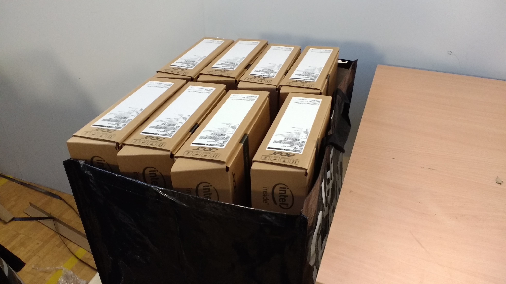

# Chromebook Mass Enrollment
This document describes the process used for mass enrolling Chromebooks for the City of Pori, Finland in the summer of 2017. Using the process allowed two persons to enroll 1600 Chromebooks (Acer R11) in 9 working days. This included time for unpacking and repacking the devices as well as OS reset and the actual enrollment.

## Equipment

### Hardware

* 1 Aten CS1788 8-port KVM-switch (DVI/USB)
* 1 Aten CS1716i 16-port KVM-switch
* 2 Arduino Leonardo Ethernet
* 1 Windows 7 laptop (any OS supporting Python and curses works)
* 1 Logitech R400 wireless presenter used to control the Python software remotely
* 1 Ethernet switch for connecting the laptop and the Arduinos
* 24 USB-extension cables (0.25 m) to allow OS recovery USB drives to be easily accessible in the enrollment rig (removed the need to chase misplaced USB drives)

### Software

* Custom Arduino code for emulating a keyboard (code available soon)
* Custom Python/curses application for commanding the Arduino through the network (code available soon)

### Other equipment

* a trolley for moving unpacked devices from the unpacking station to the enrollment rig
* 3 storage shelf unis for the enrollment rig
custom made jig for placing the devices on the shelves
* 1 electrically adjustable table for to be used as a packing station
* a suitable number of tables for the repacking (ideally these would be replaced with electrically adjustable tables)
* 9 large shopping bags (58x36x38 cm) for storing empty boxes during enrollment (8 boxes per bag)
* 10 collapsible boxes (76 x 56 x 45 cm) able to fit 21 Chromebooks (24 when not stacking). These were used for moving enrolled devices and transporting them to schools.
* some cable and cable ties to hold the USB cables (for the KVM-switch and OS recovery drives) near the shelf for easy access during the process.
* cables (USB, KVM, HDMI, CAT6), extension cords etc.

## Automating the enrollment using an Arduino device and a KVM-switch

An Arduino Leonardo Ethernet devices was used to send keyboard commands to Chromebooks. The specific Arduino model was chosen to enable sending keypresses as flexibly as possible. Using the Leonardo Ethernet, the Arduino software didn't have to depend on the keypresses to be sent. Instead it received the key data via Ethernet from a laptop. Especially during testing, not needing to continuously re-image the Arduino's software was a massive boon.

Using a single Arduino enabled automating the enrollment of a single Chromebook. To enable enrolling multiple Chromebooks simultaneously, a solution was found using a KVM-switch from Aten. These switches have support for a broadcast mode that enables sending keyboard data simultaneously to all connected devices.

Both the Arduino software as well as the Python software had to be re-written once because of API incompabilities between two Arduino keyboard libraries. The root of the problems however was that the KVM-switches failed to recognize the Arduino as a keyboard when in broadcast mode. This problem was solved by not using the built-in USB Keyboard library for Arduino that reports itself as a complex USB device. Instead the HID-Library was used to make the Arduino report itself as a simple keyboard.

As the Chromebook automation couldn't be made fool-proof (see [Post-mortem](#post-mortem)), a decision was made to insert pauses in the script sending the keypresses to the devices. A USB presenter connected to the laptop was used to resume the script remotely.

While the solution of using the KVM-switches worked, see [Arduinos all the way](#arduinos-all-the-way) for a discussion on a better alternative.

## Setup

### Hardware setup

Each Arduino devices was connected to a KVM switch that also powered the Arduino device. The Arduino devices and the scripting software communicated via wired network through a Ethernet switch. The individual Chromebooks were connected to the KVMs with a USB/KVM cable. Additionally the KVMs were each connected to a display to enable monitoring the KVM's on-screen display. 

### Worksite setup
For the enrollment 3 storage shelf units were rented. Because the rented storage shelf units had wire decking, a sheet of wood fiberboard was placed on each of the shelves to allow the devices to be easily placed on the shelf. To ease both device placement and connecting USB cords to the devices, T-shaped pieces of wood were attached to the fiberboard, essentially creating a jig.

Additionally, a wire (defective ethernet cable to be exact) was strung across the width of the storage shelves. The KVM cables and OS recovery USB drives were hung from the wire using cable ties. This allowed workers to easily locate and connect the cables as well as simply let go of cables after detaching them without damaging them.

9 large re-usable shopping bags were purchased for storing the empty boxes while the devices were being enrolled. As each bag could comfortably hold 8 boxes, it was easy to keep track of which box belonged to which device.

Collapsible boxes were purchased to aid in moving the enrolled devices during the project as well as in transporting the devices to individual schools after the enrollment project had completed. The boxes were also used for temporary storage of the packaging inserts protecting the devices in their boxes.

## Enrollment process

### General process
1. Unpack and reset OS for 9 sets of 8 devices for a total of 96 devices.
2. For each layer of 24 devices (3 sets of 8) in the enrollment rig:
  2.1. Enroll the devices.
  2.2. Pack the devices.

### Unpacking

The devices are unpacked in sets of 8 devices, with the unpacking steps divided for each worker. It was determined that the following division of labor was faster than each worker unpacking devices from start to finish separately.

  
#### Worker A

1. Break the seal on the box.
2. Open the box and hand the device (with packaging inserts) to Worker B.
3. Remove and discard the UK power cord from the box.
4. Receive protective bag from Worker B and put it in the box.
5. Close the box and place it in a bag (order right to left, back to front).

#### Worker B

1. Receive the device with packaging inserts from Worker A.
2. Remove the packaging inserts and store them for packing phase.
3. Remove the device from its protective bag and hand the bag to Worker A.
4. Place the device on a trolley and insert power plug to the device. This was required as factory sealed chromebooks will not start before being (at least briefly) in to the power source.
5. Wait until the device shows life.

After a set of 8 devices have been unpacked, move the devices and the bags with the device boxes to the enrollment space. The devices are placed on the enrollment rig and the following steps are taken for each device:

1. Connect the OS recovery USB stick to the device.
2. Open the lid of the device (starts the Chromebook).
3. Start OS Recovery.

After these steps, the inspect the previous set of 8 devices for completed OS recovery. After the OS recovery has completed, disconnect the recovery USB sticks. This causes the Chromebooks to reboot. After the reboot has been completed, close the lid on the device.

The device sets are placed one layer of 24 devices (i.e. 3 sets) at a time.

### Enrollment
After OS recovery has been completed for all 96 devices, the devices are enrolled one layer at a time (*note: for us, each layer was enrolled in sets of 8 and 16 due to the KVM-switches used*):

1. Connect the devices to the KVM switch via USB cables.
2. Restart the KVM switch (also restarts the Arduino).
3. Start the remote keyboard application on the PC.
4. Execute the enrollment script which does the following steps:
   1. Select language and keyboard layout (Finnish and Finnish).
   2. Connect to WiFi.
   3. Accept the EULA.
   4. Start Enterprise Enrollment and enter enrollment username.
   5. Check for and enter CAPTCHAs.
   6. Enter password for enrollment.
5. Manually press Enter to complete the enrollment. This was required as more than 6 simultaneous devices hitting Enter for completing the enrollment caused the enrollment to fail on most devices.
6. Finish running the enrollment script (shuts the devices down).
7. Disconnect the devices from the KVM switch (and connect the cables to the devices in the layer below).
8. Close the lids on the enrolled devices.

The enrollment process can be done by one worker, leaving the other free to prepare the repacking of devices.

### Packing
During the enrollment, one worker places the device boxes on the packing table (8 boxes side by side, 3 on top of each other). The packaging inserts are placed around the boxes for easy access while packing. 

After the enrollment has been completed for a layer of devices, the devices are moved to the packing table in front of their respective boxes. Then the devices are packed in to the boxes in two steps:
1. Place each device into the protective bag.
2. Place the device into the packing inserts and then into the box.

Doing the packing in these two phases was discovered to be faster than packing each device from start to finish.

## Post-mortem
The project of enrolling 1600 devices was completed in 9 work days plus a day both for setting up and for dismantling the enrollment setup. The first day of enrollment was quite simply disastrous and disheartening (see [Arduino / KVM-switch / Ethernet-switch sync issue](#arduino--kvm-switch--ethernet-switch-data-synchronization-issue)), but after the issues were corrected, the project proceeded as planned.

In the end the enrollment process was finished ahead of schedule. Originally a pace of 100 devices per day was set as a minimum goal with 144 devices per day being the actual target. After completing a single successful day, the size of a single set was increased from 72 to 96 devices. This allowed enrolling 192 devices per day. Without the problems faced in the first day, a full work day would have been shaved from the total duration.

### Problems encountered while testing the process

#### Simultaneous enrollment limits

A undocumented limit of 6 simultaneous enrollments was discovered during testing. Although the actual error message only mentioned a "network error", the consistent number of 6 successful enrollments indicated a Google imposed limit. At first the problem was circumvented by moving the KVM-switches out of broadcast mode and cycling the KVM-switch through each port and hitting the final <Enter> of the enrollment phase. During the actual mass enrollment, it was determined that it was faster to just manually hit the <Enter>.

### Problems encountered during the mass enrollment

#### Arduino / KVM-switch / Ethernet-switch data synchronization issue

Encountered on the first day of the actual mass enrollment, the problem seemed at first to be a minor irritant but soon grew to a near showstopper. On the actual enrollment site, the individual devices would not type all keys sent by the Arduino through the KVM-switch. Instead random keypresses were left out, causing errors in the enrollment. This was quite concerning as this problem was not encountered during testing.

Finally, after much despair and sweating, the problem was solved by plugging the Ethernet switch and the KVM-switch to the same extension cord (originally the switches were placed in two different power outlets across the room from each other). Apparently the phase difference between the two power outlets caused synchronization errors in the data communication between the different devices. *Note: a previous encounter with a different problem with the same solution (flickering image of a data projector) luckily lead us to solving this problem.*

#### CAPTCHAs
Unexpectedly, the Enterprise Enrollment in ChromeOS caused CAPTCHAs to appear when using the same username for many enrollments. This was (almost fully) eliminated by using multiple enrollment usernames - one for the 8-port KVM-switch and two for the 16-port KVM-switch (alternated between consecutive enrollments using the switch).

#### "The Error Unknown"
Throughout the process, the enrollment would fail randomly by an error described only as "An error occured. Please try again". When encountered, the enrollment was done by hand. No cause for the error was found, but was clearly a network or Google issue. The problem presented itself in roughly 2-5 devices per layer of 24 devices. 

#### Unreliability of the enrollment process
Due to the CAPTCHAs and the unknown errors as well as occasional hiccups with the KVM-switches, the enrollment process couldn't be reliably completed without supervision and/or manual intervention. This slowed down the process in terms of repacking. 

### What could be / could have been done differently

#### Arduinos all the way

Originally the enrollment was planned to be done with only the 8-port KVM-switch that was purchased for the enrollment. After the purchase, the 16-port KVM-switch was discovered in another departments server room set to be retired. The KVM-switches did work for the enrollment, but a more flexible and cheaper solution would have been to purchase multiple (24) Arduino Leonardo Ethernet boards and implement the broadcasting functionality in the Python software. 

This would have also enabled circumventing the [Simultaneous enrollment limits](#simultaneous-enrollment-limits) problem as a random delay could have been added on a per device basis. Also the KVM-switches were somewhat slow in moving in and out of the broadcast mode as well as in switching between individual ports.

#### Write the custom software in Javascript instead of Python

As a minor imperfection, the remote keyboard software used to drive the Arduinos cannot be run on a Chromebook. This could be remedied by implementing the software as a Chrome extension, that have the ability to use raw tcp sockets. This would have allowed the software to be run on ChromeOS as well as any OS for which Chrome (or Chromium) is available.

Pure javascript could have also been used to implement the software, but enabling websocket communication would have complicated the Arduino-side software.

#### Increase the workforce
With two workers, two sets of 96 devices were enrolled in a single work day quite comfortably. As a test, three sets of 96 were done in a day. With two workers this was doable, but increased the strain quite significantly and resulted in (some) overtime.

The addition of a third worker would have sped up the enrollment/packing phase considerably as the next layer could have been enrolled by one of the workers while the two others repacked the devices. To lessen fatigue from repetive work, the three workers could rotate responsibilities in the enrollment/packing phase.

In our estimates, using three workers at least 3 sets of 96 devices could comfortably completed in a single work day. Even 4 sets might be doable without the same downsides as encountered when doing 3 sets with 2 workers.

One possible downside to using three workers is the unpacking phase, which wouldn't easily benefit from the extra worker. However, this idle time could be avoided by the third worker organizing the enrolled devices and scanning the serial numbers of the enrolled devices. In our case of using 2 workers, these were handled after enrolling the sets each day (organizing the devices) and during the transportation (serial numbers).
